# Neuroflix – AI Video Director & Corporate Learning Platform

> **Built for the Google Gemini Hackathon | January 10, 2026**

We live in a world where entertainment gets attention and expertise gets ignored—because subject matter experts can't create content at the quality level needed to keep an audience's attention.

**That's why we built Neuroflix.** You bring the expertise. AI handles everything else—scripting, visuals, voiceovers, editing. Everything.

Today we started building what we believe to be **the world's first agentic video production company**—AI agents for each aspect of the production process: a Director, a Script Writer, a Set Designer, and more.

---

## Google/Gemini Technologies Used

| Technology                     | Use Case                                                                      |
| ------------------------------ | ----------------------------------------------------------------------------- |
| **Gemini 3 Pro**               | Main Director agent orchestrating the entire video workflow with 25+ tools    |
| **Gemini 3 Flash**             | Script Writer agent and syllabus generation                                   |
| **Gemini 2.0 Flash**           | Real-time voice transcription for voice-to-text input                         |
| **Gemini Deep Research Agent** | Document analysis and syllabus generation with visible tool calls             |
| **Nano Banana Pro**            | Character 4-angle references, location images, attire references, thumbnails  |
| **Veo 3.1**                    | 8-second video clip generation with native audio                              |
| **Google Lyria**               | Background music generation for final videos                                  |
| **Gemini Large Context**       | Processing complete PDF documents (training materials, compliance docs, etc.) |

---

## Table of Contents

-   [Part 1: Agentic Video Generator](#part-1-agentic-video-generator)
    -   [Agent Architecture](#agent-architecture)
    -   [The Production Agents](#the-production-agents)
    -   [25+ Tool Calls](#25-tool-calls)
-   [Part 2: Corporate Learning System](#part-2-corporate-learning-system)
-   [Tech Stack](#tech-stack)
-   [Getting Started](#getting-started)

---

## Part 1: Agentic Video Generator


### Agent Architecture

The main orchestrator—**The Director**—is powered by **Gemini 3 Pro** with a carefully crafted system instruction following [Google's Agentic Workflows Best Practices](https://ai.google.dev/gemini-api/docs/prompting-strategies#agentic-workflows).

**Key Design Decisions:**

-   **25+ Custom Tool Calls**: All tools defined using Gemini's native function declaration format with strict type definitions
-   **Sub-Agent Orchestration**: The Director invokes specialized agents (Script Writer, Set Designer) for specific tasks
-   **Agentic Loop**: Up to 10 iterations per turn, handling tool calls and function responses
-   **Progressive Disclosure**: Complexity revealed gradually—if you're unsure, the agent offers suggestions
-   **Fully Iterative**: Every workflow supports back-and-forth refinement until you're satisfied
-   **State Persistence**: Resume sessions anytime with full project state saved

```mermaid
flowchart TB
    subgraph User["👤 USER"]
        UserInput[["User Message / Upload"]]
        UserFeedback[["Feedback & Edits"]]
        UserHighlight[["Highlight Text → Context"]]
        UserApproval{{"Approve & Continue?"}}
    end

    subgraph Orchestrator["🤖 MAIN ORCHESTRATOR AGENT (Gemini 3)"]
        direction TB
        AgentCore["Gemini 3 Agent<br/>25+ Tool Calls<br/>Custom Function Calling"]
        ThinkingProcess["Reasoning & Planning"]
        ToolRouter{"Route to<br/>Sub-Workflow"}

        AgentCore --> ThinkingProcess
        ThinkingProcess --> ToolRouter
    end

    subgraph GatheringPhase["📋 REQUIREMENTS GATHERING"]
        direction TB
        Overview["Project Overview<br/>• Video concept<br/>• Aspect ratio (9:16/16:9)<br/>• Duration<br/>• Supporting docs"]
        Aesthetic["Art Style & Aesthetic<br/>• Visual style selection<br/>• Reference images<br/>• Mood & atmosphere"]
        Brand["Brand Guidelines<br/>• Logo upload<br/>• Brand colors<br/>• Brand name"]
    end

    subgraph CharacterWorkflow["👥 CHARACTER WORKFLOW"]
        direction TB
        CharInput["Character Info<br/>• Name<br/>• Reference photos (1-5)"]

        subgraph AngleGen["🎨 Angle Generation (Nano Banana Pro)"]
            GenAngles["Generate 4-Angle References<br/>Front / Side / 3-4 / Back"]
            StyleMatch["Match Project Aesthetic"]
        end

        AngleReview{{"Review Angles"}}

        subgraph VoiceClone["🎤 Voice Clone (ElevenLabs)"]
            VoiceSample["Upload Voice Sample<br/>(10+ seconds)"]
            CloneVoice["Create Voice Clone"]
        end

        CharComplete["Character Complete ✓"]

        CharInput --> AngleGen
        GenAngles --> StyleMatch
        StyleMatch --> AngleReview
        AngleReview -->|"Not satisfied"| AngleGen
        AngleReview -->|"Approved"| VoiceClone
        VoiceSample --> CloneVoice
        CloneVoice --> CharComplete
    end

    subgraph ScriptWorkflow["📝 SCRIPT WORKFLOW (Agentic Loop)"]
        direction TB

        subgraph ScriptGen["Script Generation (Gemini 3)"]
            GenerateScript["Generate Scene Breakdown<br/>Based on Overview + Characters"]
            SceneTypes["Scene Types:<br/>• scene (speaking/lip-sync)<br/>• broll (action/voiceover)<br/>• infographic (static)"]
        end

        ScriptPreview["Display Script Preview<br/>In Chat + Artifact Panel"]

        subgraph ScriptEdit["✏️ ITERATIVE EDITING LOOP"]
            direction TB
            EditOptions["User Options:<br/>1. Direct edit in panel<br/>2. Chat feedback<br/>3. Highlight → Context"]

            HighlightContext["Selected Text Added<br/>to Next Message Context"]

            subgraph FlashEdit["Quick Edits (Gemini 3 Flash)"]
                EditScene["Edit Single Scene<br/>Shows Before/After Diff"]
                BulkEdit["Bulk Scene Updates"]
            end

            DiffDisplay["Display Changes<br/>with Visual Diff"]
        end

        ScriptApproval{{"Script Finalized?"}}

        GenerateScript --> SceneTypes
        SceneTypes --> ScriptPreview
        ScriptPreview --> EditOptions
        EditOptions -->|"Highlight text"| HighlightContext
        HighlightContext --> FlashEdit
        EditOptions -->|"Chat request"| FlashEdit
        FlashEdit --> DiffDisplay
        DiffDisplay --> ScriptPreview
        ScriptPreview --> ScriptApproval
        ScriptApproval -->|"More changes"| EditOptions
    end

    subgraph PreprocessWorkflow["🎬 PREPROCESSING WORKFLOW"]
        direction TB

        AnalyzeScript["Analyze Finalized Script"]

        subgraph Extract["Extraction"]
            ExtractLocations["Extract Unique Locations"]
            ExtractAttires["Extract Character Attires"]
            TagScenes["Tag Scenes with<br/>Characters & Locations"]
        end

        subgraph AssetGen["🖼️ Asset Generation (Nano Banana Pro)"]
            GenLocations["Generate Location Images"]
            GenAttires["Generate Attire 4-Angles<br/>Per Character Per Outfit"]
        end

        AssetReview{{"Review Assets"}}

        subgraph AssetEdit["Asset Refinement"]
            EditLocation["Edit Location Image<br/>with Instructions"]
            EditAttire["Edit Attire Angles<br/>with Instructions"]
            StyleRef["Use Other Location<br/>as Style Reference"]
        end

        AnalyzeScript --> Extract
        ExtractLocations --> AssetGen
        ExtractAttires --> AssetGen
        TagScenes --> AssetGen
        AssetGen --> AssetReview
        AssetReview -->|"Needs changes"| AssetEdit
        AssetEdit --> AssetGen
    end

    subgraph ThumbnailWorkflow["🖼️ THUMBNAIL WORKFLOW"]
        direction TB

        GenThumbnails["Generate All Thumbnails<br/>(Nano Banana Pro)<br/>• Use location backgrounds<br/>• Character attire refs<br/>• Scene descriptions"]

        ThumbPreview["Display Thumbnail Grid<br/>In Chat + Artifact Panel"]

        ThumbReview{{"Review Thumbnails"}}

        EditThumb["Edit Specific Thumbnail<br/>• Camera angle<br/>• Character expression<br/>• Lighting<br/>• Composition"]

        GenThumbnails --> ThumbPreview
        ThumbPreview --> ThumbReview
        ThumbReview -->|"Edit scene N"| EditThumb
        EditThumb --> ThumbPreview
    end

    subgraph VideoWorkflow["🎬 VIDEO GENERATION WORKFLOW"]
        direction TB

        subgraph VeoGen["Video Generation (Veo 3.1)"]
            GenVideos["Generate 8-Second Clips<br/>Per Scene"]
            VideoFeatures["Features:<br/>• Thumbnail as first frame<br/>• Character ref grids (16:9)<br/>• Native audio generation<br/>• Dialogue synthesis"]
        end

        VideoPreview["Display Video Grid<br/>Playable in Interface"]

        VideoReview{{"Review Videos"}}

        GenVideos --> VideoFeatures
        VideoFeatures --> VideoPreview
        VideoPreview --> VideoReview
    end

    subgraph FinalWorkflow["🎉 FINAL VIDEO WORKFLOW"]
        direction TB

        StitchVideo["Stitch All Scenes<br/>(FFmpeg)"]

        AddMusic["Add Background Music<br/>(Google Lyria)"]

        FinalExport["Export Final Video<br/>Download Ready"]

        StitchVideo --> AddMusic
        AddMusic --> FinalExport
    end

    subgraph StateManagement["💾 STATE & PERSISTENCE"]
        ZustandStore["Zustand Store<br/>• Project state<br/>• Chat history<br/>• Checklist progress"]
        LocalPersist["LocalStorage Persistence<br/>Resume Sessions"]
    end

    %% Main Flow Connections
    UserInput --> AgentCore

    ToolRouter -->|"Gather requirements"| GatheringPhase
    ToolRouter -->|"Character setup"| CharacterWorkflow
    ToolRouter -->|"Generate/edit script"| ScriptWorkflow
    ToolRouter -->|"Preprocess assets"| PreprocessWorkflow
    ToolRouter -->|"Generate thumbnails"| ThumbnailWorkflow
    ToolRouter -->|"Generate videos"| VideoWorkflow
    ToolRouter -->|"Create final"| FinalWorkflow

    GatheringPhase --> AgentCore
    CharComplete --> AgentCore
    ScriptApproval -->|"Approved"| AgentCore
    AssetReview -->|"Approved"| AgentCore
    ThumbReview -->|"All approved"| AgentCore
    VideoReview -->|"All approved"| AgentCore
    FinalExport --> AgentCore

    %% User Interaction Points
    UserFeedback --> ScriptEdit
    UserHighlight --> HighlightContext
    UserApproval --> ScriptApproval
    UserApproval --> AssetReview
    UserApproval --> ThumbReview
    UserApproval --> VideoReview

    %% State connections
    AgentCore <--> ZustandStore
    ZustandStore <--> LocalPersist

    %% Styling
    classDef gemini fill:#4285f4,stroke:#1a73e8,color:#fff
    classDef nanoBanana fill:#34a853,stroke:#1e8e3e,color:#fff
    classDef veo fill:#ea4335,stroke:#c5221f,color:#fff
    classDef lyria fill:#fbbc04,stroke:#f9ab00,color:#000
    classDef user fill:#9334e9,stroke:#7c3aed,color:#fff
    classDef approval fill:#f97316,stroke:#ea580c,color:#fff

    class AgentCore,ThinkingProcess,GenerateScript,EditScene,BulkEdit gemini
    class GenAngles,GenLocations,GenAttires,GenThumbnails,EditThumb,EditLocation,EditAttire nanoBanana
    class GenVideos,VideoFeatures veo
    class AddMusic lyria
    class UserInput,UserFeedback,UserHighlight user
    class UserApproval,AngleReview,ScriptApproval,AssetReview,ThumbReview,VideoReview approval
```



### The Production Agents

From a single document upload to a finished video—all orchestrated by Gemini 3 Pro:

**1. Director Agent** (Gemini 3 Pro)
The main orchestrator. Analyzes your uploaded document, asks about video specifications, and guides you through decisions. If you're unsure about any choice, it offers creative suggestions.

**2. Visual Stylist**
Captures your art style preferences (3D animation, realistic, anime, etc.). Upload a logo and it extracts brand colors for consistent use throughout.

**3. Character Artist** (Nano Banana Pro)
Upload reference photos and the agent generates 4-angle references—front, side, three-quarter, and back—all styled in your chosen aesthetic. Not satisfied? Ask for edits directly.


**4. Script Writer** (Gemini 3 Flash)
Generates a complete script from your document, characters, and aesthetic. Supports highlight-to-context editing: select any text to add it as context for your next request. Direct edits and agent-assisted changes show before/after diffs.


**5. Set Designer** (Nano Banana Pro)
Analyzes the finalized script to extract locations and character outfits. Generates location images and 4-angle attire references. "The kitchen looks too plain?" → Only that location regenerates.

**6. Thumbnail Artist** (Nano Banana Pro)
Creates preview frames for each scene combining all learned context—locations, characters in specific attires, scene descriptions. Full iterative refinement supported.


**7. Video Producer** (Veo 3.1)
Generates 8-second video clips per scene using thumbnails as reference frames. For landscape videos, character reference grids ensure consistency.

**8. Post-Production**
Stitches all clips together, adds **Google Lyria** background music, and delivers the final video for download.

### 25+ Tool Calls

The Director has access to a comprehensive toolkit:

| Category          | Tools                                                                                                                        | Description                               |
| ----------------- | ---------------------------------------------------------------------------------------------------------------------------- | ----------------------------------------- |
| **Project Setup** | `save_overview`, `save_aesthetic`, `save_brand`                                                                              | Capture project requirements              |
| **Characters**    | `add_character`, `update_character`, `generate_character_angles`, `create_voice_clone`                                       | Character management and asset generation |
| **Script**        | `generate_script`, `edit_scene`, `update_script`, `add_scene`, `remove_scene`                                                | Full script authoring and editing         |
| **Set Design**    | `preprocess_script`, `generate_preprocessing_assets`, `generate_location_image`, `edit_location_image`, `edit_attire_angles` | Scene analysis and asset preparation      |
| **Thumbnails**    | `generate_all_thumbnails`, `edit_thumbnail`                                                                                  | Preview frame generation                  |
| **Video**         | `generate_all_videos`, `stitch_final_video`                                                                                  | Video clip and final video creation       |
| **UI/UX**         | `update_checklist`, `show_preview`, `request_upload`                                                                         | Interface management                      |

---

## Part 2: Corporate Learning System

For production deployment targeting the corporate sector, we've built the expansion path.


### Deep Research Agent

Upload any training document and **Gemini's Deep Research Agent** analyzes it in real-time. You can see the tool calls as it searches, reads, and extracts concepts:

-   **Large Context Processing**: Leverages Gemini's massive context window to understand complete documents
-   **Intelligent Analysis**: Breaks down complex materials into structured learning content
-   **Tool Call Visibility**: Watch the agent's search queries, document reads, and research outputs live
-   **Streaming Progress**: Real-time updates show the agent's thinking process

<!-- MERMAID DIAGRAM PLACEHOLDER
Prompt: "Create a Mermaid sequence diagram showing the Gemini Deep Research Agent workflow: User uploads PDF → Deep Research Agent starts → Multiple tool calls (search_documents, read_section, extract_concepts) shown in parallel → Agent synthesizes → Structures into syllabus → Output with Modules, Learning Objectives, Questions. Show tool calls visible to user in real-time. Clean professional style."
-->

### Intelligent Syllabus Generation

The agent creates structured learning syllabi with:

-   **Modules**: Logical groupings of related content
-   **Learning Objectives**: Clear outcomes aligned to Bloom's Taxonomy (Remember → Understand → Apply → Analyze → Evaluate → Create)
-   **Assessment Questions**: Auto-generated at various cognitive levels (multiple choice, true/false, short answer, essay)
-   **Interactive Visualization**: Mind map and grid views for exploring and editing

A complete agentic AI workflow from documents to syllabi to training videos.

---

## Tech Stack

-   **Framework**: Next.js 16 (App Router)
-   **Language**: TypeScript
-   **Styling**: Tailwind CSS 4 + Shadcn UI + Radix UI
-   **State Management**: Zustand with persistence
-   **File Uploads**: UploadThing
-   **Video Processing**: FFmpeg + Sharp
-   **AI Models**: Google Gemini API (`@google/genai`)
-   **Flow Visualization**: XY Flow (React Flow)

---

## Getting Started

### Prerequisites

-   Node.js 18+
-   Google AI API Key (Gemini)
-   UploadThing credentials

### Quick Start

```bash
# Clone and install
git clone https://github.com/antoinekllee/neuroflix-gemini-hack.git
cd neuroflix
npm install

# Run development server
npm run dev
```

---

---

<p align="center">
  <b>Neuroflix</b> – Where AI Directs Your Vision
</p>
